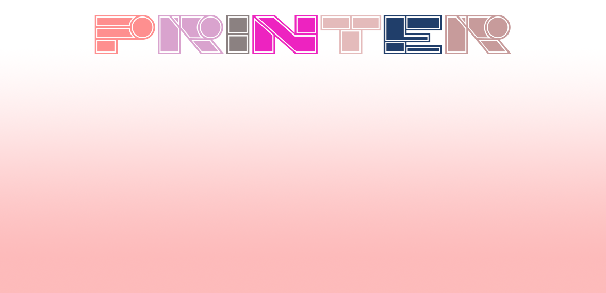
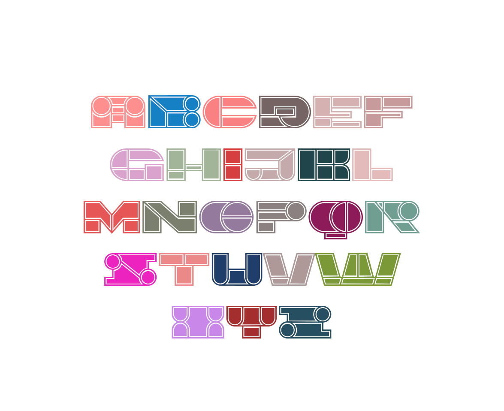
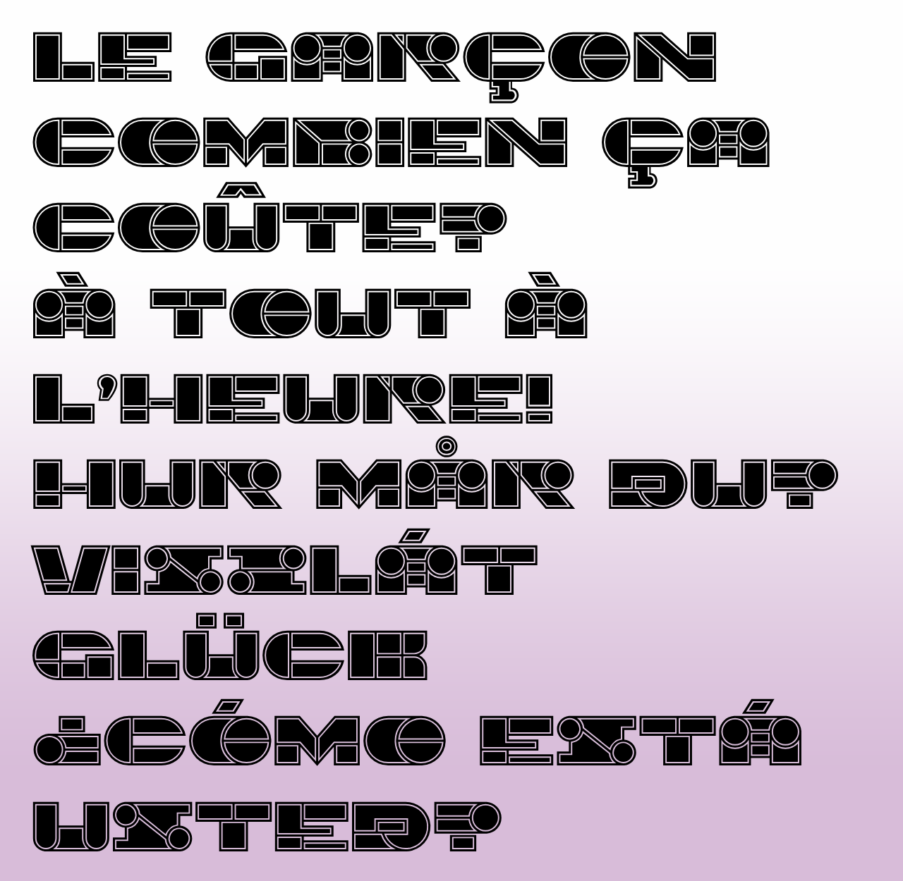

 
#   Printer

# Printer Typeface

In computing, a printer is a peripheral machine which makes a durable representation of graphics or text, usually on paper.

## Variable Font Axe

Printer has the following axe:

Axis | Tag | Default | Static Instances
--- | --- | --- | ---
Weight | wght | 400 | Regular

## License

This Font Software is licensed under the SIL Open Font License, Version 1.1.
This license is available with a FAQ at [https://openfontlicense.org](https://openfontlicense.org)
